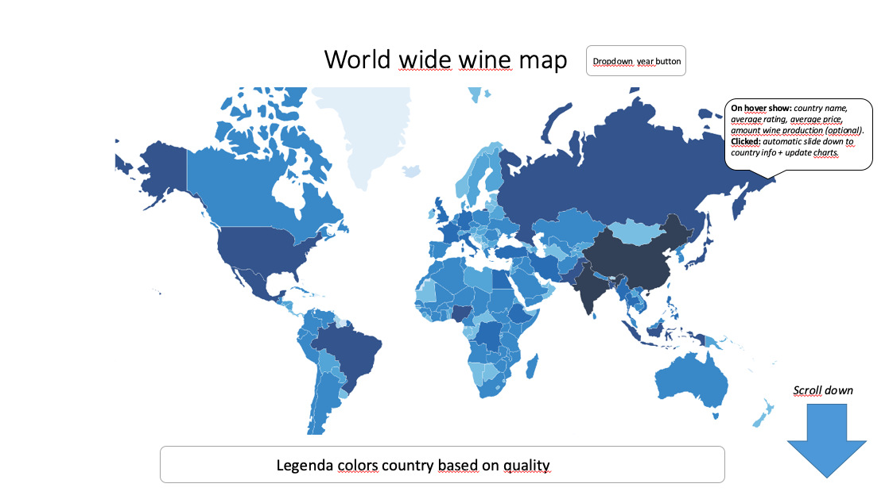

# project2019
Programmeerproject 2019
Lisette van Nieuwkerk
10590919

1. Problem statement
  * Problem: Obtain information about the wine production in countries, concerning the amount, prices, grape types and quality over the years. The product will help people discover where the best quality wines are produced over the years. As well as which wines have the best price-quality ratio, where they come from and which grape type is used.
  * Target audience: People who are interested in wine

2. Solution
  * Show wine production world wide and give an overview of quality, price, grape type and descriptions of wines per country
  * Visual sketch
  
  * Main features:
    MVP: worldmap + piechart + scatterplot
    Optional: barchart + word cloud

3. Prerequisites
  * Data sources: https://www.kaggle.com/zynicide/wine-reviews/downloads/wine-reviews.zip/4#winemag-data-130k-v2.csv
  * External components: d3.js, datamaps.js, d3-tip
  * Examples: https://public.tableau.com/s/gallery/asylum-seekers-europe
  * Possible technical problems: Linking all data and charts properly
