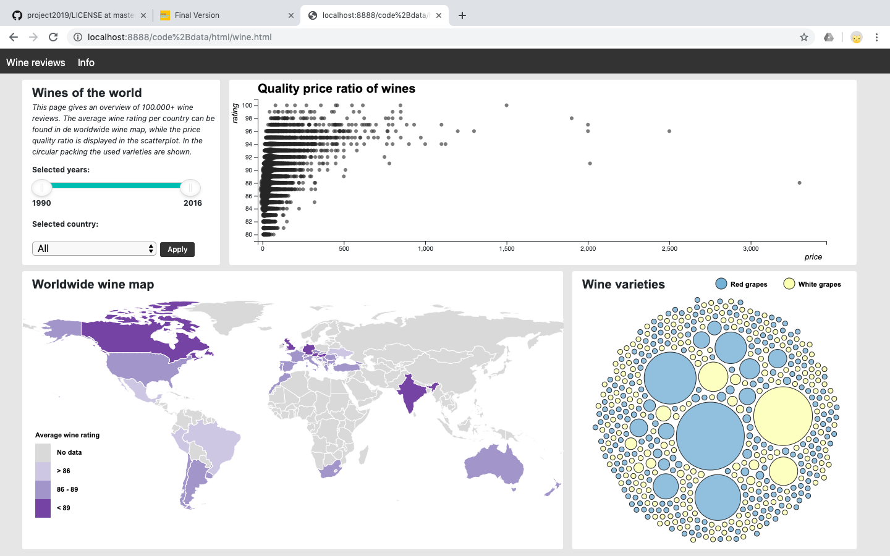

# Programmeerproject 2019
* Lisette van Nieuwkerk
* 10590919

# Introduction
On the wine reviews page a dashboard is displayed visualizing the data of 100.000+ wine reviews. The average wine rating per country can be found in de worldwide wine map, while the price quality ratio is displayed in the scatterplot. In the circular packing the used varieties are shown. This dashboard is meant for people who are interested in wine and can be used to find the best quality price wine of a certain year, country and/or variety.

# Screenshot
  

# Features
* A worldmap displays the average wine rating per country, also the amount of reviewed wines per country is shown. By clicking on a country on the worldmap the scatterplot and circularpacking will adapt to data of that country.

* In the scatterplot the price quality ratio of the wines is displayed. THe wines are sorted by groups. The bigger the circle in the scatterplot, the more wines are part of that group.

* The circularpacking the different varieties of the wines are visualized. The varieties of red grapes are blue and the varieties of white grapes are yellow. By clicking on a variety the scatterpot will adapt to wines of only that variety.

* A selection can be made for the years when the wines are produced in the slider. With the slider a minimum year and a maximum year between 1990 and 2016 can be selected, also just one spefic year can be selected. The worldmap, scatterplot and circularpacking will adapt to this.

* A specific country can be selected with the drowdown menu. The scatterplot and circularpacking will adapt to this.

# External sources
<li><a href="https://d3js.org/">D3 V5</a></li>
<li><a href="https://d3js.org/">D3 V3</a></li>
<li><a href="https://datamaps.github.io/">Datamaps worldmap</a></li> 
<li><a href="https://getbootstrap.com/">Bootstrap</a></li>
<li><a href="https://refreshless.com/nouislider/slider-values/">NoUiSlider</a></li>
<li><a href="https://bl.ocks.org/EfratVil/d956f19f2e56a05c31fb6583beccfda7 ">Zoom function</a></li>
<li><a href="https://www.kaggle.com/zynicide/wine-reviews#winemag-data_first150k.csv">Wine reviews </a></li>
<li><a href="https://www.d3indepth.com/force-layout/*/">Simulation of circular packing </a></li>
<li><a href="https://en.wikipedia.org/wiki/List_of_grape_varieties ">Grape types</a></li>

# Video
<li><a href="https://youtu.be/NVDhbQ7GPCQ/">Demo</a></li>

# Copyright
For all files except external sources, GNU GENERAL PUBLIC LICENSE (c) 2019, Lisette van Nieuwkerk