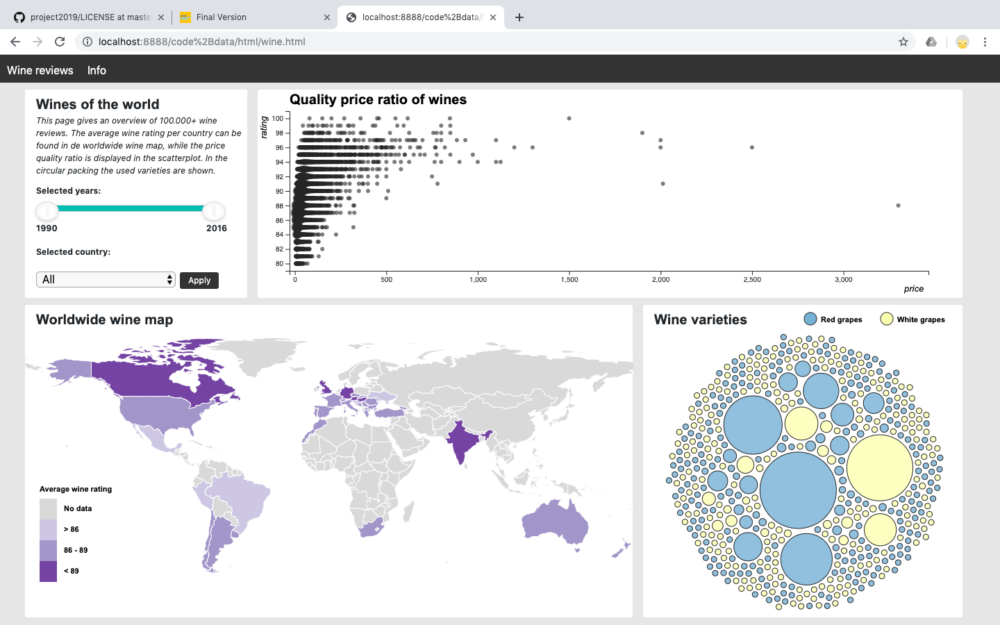

* Lisette van Nieuwkerk
* 10590919

1. Introduction
On the wine reviews page a dashboard is displayed visualizing the data of 100.000+ wine reviews. The data is displayed in a scatterplot, worldmap and circularpacking. This dashboard is meant for people who are interested in wine and can be used to find the best quality price wine of a certain year, country and/or variety.

2. Technical design
    * All the code and code can be found in the map data+code

# HTML
* The created content is visible in the two html pages. In wine.html the dashboard is displayed and in info.html information about the dashboard can be found. The navigiation bar above both pages makes it possible to switch pages.

# CSS 
 * All the css can be found in wine css. On the top the style component of the overall design can be found, when scrolling to the bottom the css code gets more spefic for certain small compontents. THe code is grouped per element. 

# Python
* The proceprocessdata.py does multiple thing. It scrapes the list of wine varieties and corresponding grapetype from wikipedia. It also reads the countrycode.txt file whith countrycode. As a next step it reads the csv file with all the wine reviews into a dataframe.

* The dataframe is filtered on duplicates and unneeded columns. The grape types are added to the data columns based on the corresponding variety, as well as the countrycode, based on the corresponding countryname. Furthermore the wine years (1990-2016) are filtered out of the titles and added to the dataframe. In the end rows with empty values are removes, the years will be set to integers and the dataframe will be written into a json file. 

# Javascript
* The page is loaded in index.js. Some global variables are set. The elements of the page are created by calling function from other files. For that scatterplot and the circularpacking first a basic figure is drawn, and then the other content follow. The on click function of the drowndown button and the slider are set on this page, after the events the corresponding figures will be adapted. The slider adapts all the figures, the drowndown button only the scatterplot and circularpacking.

* In circularpacking.js the circularpacking is created. It consists of a function to create the svg figure, title and legenda and one other that creates the other parts. An on click event is attached to clicking on the circles, the scatterplot will update with only the corresponding variety.

* In scatterplot.js the scatterplot is created. Just like the circularpacking the first function drawns the svg figure, with the title and labels. The createscales function calculates the scales for the axises and the size of the circles. The drawScatter function draws first, when executed for the first time, the scatterplotcontent area, the axises, creates the brush to zoom. When performed for the second time it only updates the axises. Furthermore it creates the scatter circles and attaches a pop up modal to the circles which is shown when clicked on. 

* In the datamap.js the drawMapAttributes() function creates the titel and legend of the map. The second function add the data of the map as options to the drowndown button and creates the map, with a tooltip and corresponding country colors. An on click event is attached to clicking on the countries, the scatterplot and circularpacking will update after this with data only from this country. The updateDatamap function updates the country values and colors.

* Processdata.js contains all the functions that process the data for figures. It contains functions to calculate the mininum and maximum, a function to group the data for the scatterplot, get the amount of varieties for the circularpacking and define the colors of the countries for the worldmap by calculating the average rating. 

3. Challenges
    * Problem: the amount of data made the  application very slow. Filtering the years from the title and adding the countrycodes in javascript costed too much time. Solution: I decided to do as most as possible of the processing of the data in python and save this into a csv file so it only needed to be loaded in js. 

    * Only the wine years from 1990 until 2016 can be found in the csv because most wines were produced in those years. When the title contained two years, mostly the other one was the year of the foundation of the winery, so I decided to always choose the highest number as the production year.

    * Problem: amount of data in scatterplot made the figure unclear. Solution: do not plot seperate wines on scatterplot but groups and make it possible to zoom in. At first only a zoom function the x axis was made (because this axis was very large), but I later extended it to the Y-axis as well because made it easer to see groups of circles seperatly.

    * Problem: A piechart was not functional to show all the different varieties. Solution: I choose a circularpacking instead. Turned out to be a better way to visualize the data. 

    * Problem: connecting all figures with up to date variables. For example: updating the scatterplot by clicking on the circularpacking and making sure the selected country as well is remembered. Solution: using global variables like window.country.

    * Feedback: give circularpacking colors to make it look better. Solution: adding grape types to the data (red or white grapes).

    * Problem: when adding grape types some varieties can be made from both red or white grapes. Solution: I filtered the double ones or unclear varieties out.

    * Feedback: update figures with update functions and not just remove and add the data. Solution: I added this for the worldmap and scatterplot, i couldn't update the circularpacking without removing the data first because it didn't work with the simulation of the circles. In the end i decided to go for the remove and add method. 

4. Final state application
    * The application seems to work properly and all the figures are connected. In the beginning I intented to also make a barchart of the wine production but this seemed irrelevant to me half way, because you could see the total wine production in the worldmap. If I had more time I would add a button to reset the variety variable to all and add text to make the currently selected country and variety visible so its clear which variables are selected. 